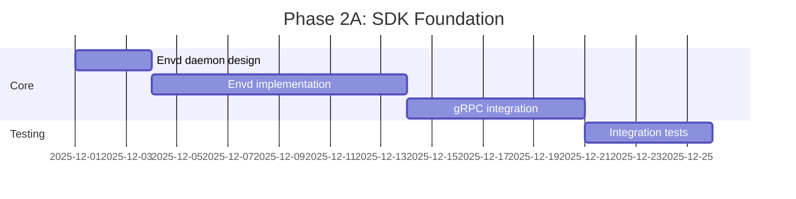

# Deep Feature Review: E2B Infrastructure Analysis

> **Document Purpose**: Comprehensive technical analysis of [e2b-dev/infra](https://github.com/e2b-dev/infra) repository with actionable improvement recommendations for NanoFuse.

**Review Date**: 2025-11-27
**Reviewer**: Claude (automated analysis)
**E2B Repo Stats**: 734 stars, 197 forks, 5,814 commits, Apache-2.0 License

---

## Table of Contents

1. [Executive Summary](#executive-summary)
2. [E2B Architecture Overview](#e2b-architecture-overview)
3. [Core Components Deep Dive](#core-components-deep-dive)
4. [Technical Implementation Analysis](#technical-implementation-analysis)
5. [Feature-by-Feature Comparison](#feature-by-feature-comparison)
6. [Key Differentiators & Design Decisions](#key-differentiators--design-decisions)
7. [Improvement Recommendations for NanoFuse](#improvement-recommendations-for-nanofuse)
8. [Implementation Roadmap](#implementation-roadmap)
9. [Chain of Thought Analysis](#chain-of-thought-analysis)

---

## Executive Summary

### What is E2B Infrastructure?

E2B (short for "Environment to Binary") is an **open-source cloud infrastructure for AI code interpreting**. The infrastructure repository (`e2b-dev/infra`) contains the backend systems that power E2B Cloud, enabling:

- Secure execution of AI-generated code in isolated sandboxes
- Fast microVM boot times using Firecracker
- Template-based sandbox provisioning
- Multi-tenant isolation with per-request sandboxes

### Key Findings

| Aspect | E2B Approach | NanoFuse Current State | Gap Analysis |
|--------|-------------|----------------------|--------------|
| **Orchestration** | Nomad + gRPC + Consul | Direct process management | Significant gap |
| **VM Technology** | Firecracker + userfaultfd + NBD | Firecracker (basic) | Medium gap |
| **Storage** | Network Block Device (NBD) + GCS | Local disk only | Significant gap |
| **Networking** | iptables + netlink + firewall policies | NAT + bridge + IPAM | Small gap |
| **API Layer** | REST (Gin) + gRPC + OpenAPI | REST (stdlib) | Medium gap |
| **Observability** | OpenTelemetry + Grafana stack | Basic logging | Significant gap |
| **Template System** | Build streaming + layer caching | Snapshot-based (planned) | Significant gap |
| **Database** | PostgreSQL + ClickHouse + Redis | SQLite | Medium gap |
| **Deployment** | Terraform + GCP | Manual/Docker | Significant gap |

### Top 5 Priority Improvements for NanoFuse

1. **gRPC Protocol for Orchestration** - Enable efficient streaming and service communication
2. **Network Block Device (NBD) Support** - Cloud-native storage backends
3. **OpenTelemetry Integration** - Production-grade observability
4. **Template Build Streaming** - Real-time build logs and progress
5. **Envd In-VM Daemon** - SDK interaction layer inside sandboxes

---

## E2B Architecture Overview

### System Architecture Diagram

```
┌─────────────────────────────────────────────────────────────────────────────┐
│                              E2B Cloud Architecture                          │
├─────────────────────────────────────────────────────────────────────────────┤
│                                                                              │
│  ┌──────────────┐     ┌──────────────┐     ┌──────────────┐                 │
│  │   SDKs       │     │   CLI        │     │  Dashboard   │                 │
│  │ (JS/Python)  │     │              │     │   (Web UI)   │                 │
│  └──────┬───────┘     └──────┬───────┘     └──────┬───────┘                 │
│         │                    │                    │                          │
│         └────────────────────┼────────────────────┘                          │
│                              │ HTTPS                                         │
│                              ▼                                               │
│  ┌───────────────────────────────────────────────────────────────────────┐  │
│  │                         Client Proxy (Edge)                            │  │
│  │  - Consul service discovery                                            │  │
│  │  - Request routing                                                     │  │
│  │  - WebSocket proxying                                                  │  │
│  └───────────────────────────────────┬───────────────────────────────────┘  │
│                                      │                                       │
│         ┌────────────────────────────┼────────────────────────────┐         │
│         │                            │                            │         │
│         ▼                            ▼                            ▼         │
│  ┌─────────────┐            ┌─────────────┐             ┌─────────────┐     │
│  │   API       │            │ Orchestrator│             │  Template   │     │
│  │  Service    │◄──────────►│   Service   │◄───────────►│  Manager    │     │
│  │  (Gin/REST) │   gRPC     │  (Nomad)    │    gRPC     │  (Builds)   │     │
│  └──────┬──────┘            └──────┬──────┘             └──────┬──────┘     │
│         │                          │                           │            │
│         │                          │                           │            │
│         ▼                          ▼                           ▼            │
│  ┌─────────────┐            ┌─────────────┐             ┌─────────────┐     │
│  │ PostgreSQL  │            │ Firecracker │             │ GCS Bucket  │     │
│  │ (Supabase)  │            │  MicroVMs   │             │ (Templates) │     │
│  └─────────────┘            └──────┬──────┘             └─────────────┘     │
│                                    │                                         │
│                                    ▼                                         │
│                             ┌─────────────┐                                  │
│                             │    envd     │ (In-VM Daemon)                   │
│                             │ - Process   │                                  │
│                             │ - Files     │                                  │
│                             │ - Ports     │                                  │
│                             └─────────────┘                                  │
│                                                                              │
├─────────────────────────────────────────────────────────────────────────────┤
│  Observability: OpenTelemetry → Grafana (Loki/Tempo/Mimir)                  │
│  Analytics: ClickHouse                                                       │
│  Caching: Redis                                                              │
└─────────────────────────────────────────────────────────────────────────────┘
```

### Technology Stack

| Layer | Technology | Purpose |
|-------|-----------|---------|
| **Language** | Go 1.25.4 (84.7%) | Primary implementation |
| **IaC** | Terraform (HCL 8.3%) | Infrastructure provisioning |
| **Container Orchestration** | Nomad | Workload scheduling |
| **Service Discovery** | Consul | Service mesh |
| **VM Technology** | Firecracker | MicroVM isolation |
| **Primary Database** | PostgreSQL (Supabase) | Transactional data |
| **Analytics Database** | ClickHouse | Time-series/analytics |
| **Cache/State** | Redis | Session/state management |
| **Object Storage** | GCS Buckets | Template artifacts |
| **Observability** | OpenTelemetry | Distributed tracing |
| **API Framework** | Gin | REST endpoints |
| **RPC Framework** | gRPC + Connect | Service communication |

---

## Core Components Deep Dive

### 1. API Service (`packages/api/`)

**Purpose**: External-facing REST API for sandbox and template management.

**Key Features**:
- JWT authentication via Supabase
- OpenAPI-generated code for type safety (oapi-codegen)
- Gin framework for HTTP handling
- Port 80 exposure

**Internal Package Structure**:
```
packages/api/internal/
├── analytics_collector/  # Usage metrics collection
├── api/                  # Core API implementation
├── auth/                 # JWT/Supabase authentication
├── cache/                # Request caching
├── cfg/                  # Configuration management
├── constants/            # Application constants
├── db/                   # Database operations
├── edge/                 # Edge service integration
├── grpc/                 # gRPC client connections
├── handlers/             # HTTP request handlers
├── metrics/              # Observability metrics
├── middleware/           # HTTP middleware
├── orchestrator/         # Orchestrator client
├── sandbox/              # Sandbox management
├── team/                 # Multi-tenancy
├── template-manager/     # Template lifecycle
├── template/             # Template models
└── utils/                # Utilities
```

**NanoFuse Comparison**:
- NanoFuse uses stdlib `net/http` (simpler but less feature-rich)
- No OpenAPI code generation in NanoFuse
- No dedicated authentication layer in NanoFuse

**Recommendation**: Consider adopting oapi-codegen for type-safe API development.

---

### 2. Orchestrator Service (`packages/orchestrator/`)

**Purpose**: Core sandbox lifecycle management and Firecracker orchestration.

**Key Features**:
- gRPC server for VM communication
- Firecracker microVM lifecycle management
- Network management via iptables and netlink
- Storage via Network Block Device (NBD)
- Template caching in GCS buckets
- Snapshot creation and restoration

**Protocol Buffer Definitions**:

**`orchestrator.proto`** - Main sandbox service:
```protobuf
service SandboxService {
  rpc Create(SandboxCreateRequest) returns (SandboxCreateResponse);
  rpc Update(SandboxUpdateRequest) returns (google.protobuf.Empty);
  rpc List(google.protobuf.Empty) returns (SandboxListResponse);
  rpc Delete(SandboxDeleteRequest) returns (google.protobuf.Empty);
  rpc Pause(SandboxPauseRequest) returns (google.protobuf.Empty);
  rpc ListCachedBuilds(google.protobuf.Empty) returns (SandboxListCachedBuildsResponse);
}
```

**Key Message: `SandboxConfig`**:
- Template and build identifiers
- VM specifications (vCPU, RAM, disk)
- Environment variables and metadata
- Network configuration (egress/ingress rules)
- Lifecycle settings (auto-pause, max length, snapshots)

**`template-manager.proto`** - Build management:
```protobuf
service TemplateService {
  rpc TemplateCreate(TemplateCreateRequest) returns (TemplateCreateResponse);
  rpc TemplateBuildStatus(TemplateBuildStatusRequest) returns (stream TemplateBuildStatusResponse);
  rpc TemplateBuildDelete(TemplateBuildDeleteRequest) returns (google.protobuf.Empty);
  rpc InitLayerFileUpload(InitLayerFileUploadRequest) returns (InitLayerFileUploadResponse);
}
```

**Internal Package Structure**:
```
packages/orchestrator/internal/
├── cfg/            # Configuration
├── events/         # Event handling
├── factories/      # Factory patterns
├── healthcheck/    # Health monitoring
├── hyperloopserver/# Hyperloop server
├── metrics/        # Metrics collection
├── proxy/          # Proxy functionality
├── sandbox/        # Sandbox management
│   ├── block/      # Block device management
│   ├── build/      # Build processes
│   ├── fc/         # Firecracker integration
│   │   ├── client.go        # FC API client
│   │   ├── config.go        # FC configuration
│   │   ├── kernel_args.go   # Kernel arguments
│   │   ├── mmds.go          # Metadata service
│   │   ├── process.go       # Process management
│   │   └── script_builder.go# Init scripts
│   ├── nbd/        # Network Block Device
│   │   ├── dispatch.go      # Request dispatch
│   │   ├── path_direct.go   # Direct paths
│   │   └── pool.go          # Connection pooling
│   ├── network/    # Network management
│   │   ├── firewall.go      # Firewall rules
│   │   ├── host.go          # Host networking
│   │   ├── network.go       # Core networking
│   │   ├── pool.go          # Resource pooling
│   │   ├── slot.go          # Network slots
│   │   └── storage_*.go     # State backends
│   ├── rootfs/     # Filesystem management
│   │   ├── direct.go        # Direct mounting
│   │   ├── nbd.go           # NBD rootfs
│   │   └── rootfs.go        # Core rootfs
│   ├── socket/     # Socket management
│   ├── template/   # Template handling
│   └── uffd/       # userfaultfd (memory)
│       ├── uffd.go          # Core uffd
│       ├── memory_backend.go# Memory backend
│       ├── memory/          # Memory utils
│       ├── fdexit/          # FD handling
│       └── userfaultfd/     # uffd impl
├── server/         # Server components
├── service/        # Service layer
└── template/       # Template management
```

**NanoFuse Comparison**:
- NanoFuse has basic Firecracker integration (`internal/firecracker/vm.go`)
- No gRPC in NanoFuse - uses REST only
- No NBD support - local disk only
- No userfaultfd for memory management
- Simpler network layer (NAT + bridge)

---

### 3. Envd - In-VM Daemon (`packages/envd/`)

**Purpose**: Daemon running inside each sandbox for SDK interaction.

**Key Features**:
- Connect RPC protocol (gRPC-web compatible)
- Process execution and management
- Filesystem operations
- Port management and forwarding
- Listens on port 49983

**Internal Package Structure**:
```
packages/envd/internal/
├── api/           # API handlers
├── execcontext/   # Execution contexts
├── host/          # Host interactions
├── logs/          # Log management
├── permissions/   # Permission controls
├── port/          # Port management
├── services/      # Service implementations
└── utils/         # Utilities
```

**NanoFuse Status**: Planned as `nanofuse-envd` but not implemented.

**Recommendation**: High priority - enables SDK integration.

---

### 4. Client Proxy (`packages/client-proxy/`)

**Purpose**: Edge routing with Consul service discovery.

**Key Features**:
- Request routing to appropriate backends
- WebSocket proxying for real-time communication
- Service discovery via Consul
- Health check integration

**NanoFuse Comparison**:
- NanoFuse has no proxy layer
- Direct client-to-daemon communication

**Recommendation**: Useful for multi-node deployments; defer for single-node.

---

### 5. Database Layer (`packages/db/`)

**Purpose**: PostgreSQL database abstraction.

**Key Features**:
- sqlc for type-safe query generation
- Migration management
- Transaction support
- Type definitions

**Structure**:
```
packages/db/
├── client/      # DB client
├── dberrors/    # Error types
├── migrations/  # Schema migrations
├── queries/     # SQL queries
├── scripts/     # Utility scripts
├── tests/       # Test suite
├── testutils/   # Test helpers
├── types/       # Type definitions
└── sqlc.yaml    # sqlc config
```

**NanoFuse Comparison**:
- NanoFuse uses SQLite (simpler, single-file)
- No sqlc - manual SQL
- Basic schema (`internal/storage/schema.go`)

**Recommendation**: Consider sqlc for type safety as complexity grows.

---

### 6. OpenTelemetry Collector (`packages/otel-collector/`)

**Purpose**: Centralized telemetry collection.

**Integration Points**:
- Grafana for visualization
- Loki for logs
- Tempo for traces
- Mimir for metrics

**NanoFuse Status**: No observability layer.

**Recommendation**: Critical for production readiness.

---

### 7. ClickHouse Analytics (`packages/clickhouse/`)

**Purpose**: Analytics and time-series data.

**Use Cases**:
- Usage metrics
- Performance analytics
- Billing data
- Audit logs

**NanoFuse Status**: Not implemented.

**Recommendation**: Useful for SaaS metrics; defer for self-hosted.

---

## Technical Implementation Analysis

### Chain of Thought: How E2B Achieves Fast Boot Times

**Step 1: Template Building**
```
User Dockerfile → Build Process → Base rootfs + overlay layers → GCS storage
```
- Templates are pre-built and stored
- Layer caching reduces rebuild time
- Artifacts stored in cloud storage (GCS)

**Step 2: Sandbox Creation Request**
```
SDK Request → API → Orchestrator → Select Node → Allocate Resources
```
- gRPC provides efficient serialization
- Nomad handles node selection
- Resource pooling pre-allocates VMs

**Step 3: VM Instantiation**
```
Load template → Setup NBD → Configure uffd → Start Firecracker → Boot
```
- NBD mounts rootfs from cloud storage
- userfaultfd enables demand paging
- Memory is loaded on-demand (not pre-loaded)
- Firecracker starts with minimal config

**Step 4: In-VM Initialization**
```
Kernel boot → systemd → envd starts → Ready for SDK
```
- envd exposes gRPC interface
- SDK can immediately execute code
- Logs streamed via Hyperloop

**Key Optimization Techniques**:
1. **Pre-warmed pools**: VMs started before requests
2. **Demand paging**: Memory loaded lazily via uffd
3. **Network Block Device**: No local disk copy needed
4. **Template caching**: Hot templates stay in memory
5. **Minimal kernel**: Custom kernel with only needed features

---

### Chain of Thought: Network Architecture

**E2B Network Stack**:
```
┌─────────────────────────────────────────────────┐
│                   Internet                       │
└────────────────────────┬────────────────────────┘
                         │
┌────────────────────────▼────────────────────────┐
│              Host Network (iptables)             │
│  - NAT for outbound                              │
│  - Port forwarding for inbound                   │
│  - Firewall rules per sandbox                    │
└────────────────────────┬────────────────────────┘
                         │
┌────────────────────────▼────────────────────────┐
│              Network Slot Pool                   │
│  - Pre-allocated TAP devices                     │
│  - IP address pool                               │
│  - MAC address generation                        │
└────────────────────────┬────────────────────────┘
                         │
┌────────────────────────▼────────────────────────┐
│              Per-Sandbox Network                 │
│  - Dedicated TAP device                          │
│  - Unique IP address                             │
│  - Configurable egress rules                     │
│  - Ingress access tokens                         │
└─────────────────────────────────────────────────┘
```

**Key Network Features**:
1. **Egress policies**: Configurable allowed/denied CIDR ranges
2. **Ingress tokens**: Access control for sandbox endpoints
3. **Host masking**: Hide internal topology
4. **Network slots**: Pre-allocated for fast provisioning
5. **Multiple storage backends**: Memory, local, KV store

**NanoFuse Current State**:
- NAT + bridge setup (similar base)
- IPAM with 172.16.0.10-254 pool
- TAP device per VM
- No egress/ingress policies
- No pre-allocated slots

**Recommendation**: Add network policy enforcement.

---

### Chain of Thought: Storage Architecture

**E2B Storage Model**:
```
┌───────────────────────────────────────────────────────────┐
│                    GCS Bucket (Templates)                  │
│  ┌─────────────────────────────────────────────────────┐  │
│  │  template-abc/                                       │  │
│  │  ├── rootfs.ext4        (base filesystem)           │  │
│  │  ├── kernel             (vmlinux)                   │  │
│  │  ├── config.json        (Firecracker config)        │  │
│  │  └── layers/            (overlay layers)            │  │
│  └─────────────────────────────────────────────────────┘  │
└───────────────────────────────────────────────────────────┘
                              │
                              │ NBD Protocol
                              ▼
┌───────────────────────────────────────────────────────────┐
│                    NBD Server (Orchestrator)               │
│  - Connection pooling                                      │
│  - Direct path optimization                                │
│  - Caching layer                                           │
└───────────────────────────────────────────────────────────┘
                              │
                              │ NBD Client
                              ▼
┌───────────────────────────────────────────────────────────┐
│                    Firecracker VM                          │
│  - rootfs mounted via NBD                                  │
│  - Copy-on-write for modifications                         │
│  - Snapshot support                                        │
└───────────────────────────────────────────────────────────┘
```

**NanoFuse Current State**:
- Local disk storage only
- OCI image extraction to local paths
- Direct Firecracker disk attachment

**Gap**: No cloud storage integration, no NBD support.

**Recommendation**: Implement NBD for scalable storage.

---

## Feature-by-Feature Comparison

### API Endpoints Comparison

| E2B Endpoint | Description | NanoFuse Equivalent | Gap |
|--------------|-------------|-------------------|-----|
| `POST /sandboxes` | Create sandbox | `POST /vms` | Partial |
| `GET /sandboxes` | List sandboxes | `GET /vms` | Complete |
| `GET /sandboxes/{id}` | Get sandbox | `GET /vms/{id}` | Complete |
| `DELETE /sandboxes/{id}` | Delete sandbox | `DELETE /vms/{id}` | Complete |
| `POST /sandboxes/{id}/pause` | Pause | `POST /vms/{id}/pause` | Stub |
| `POST /sandboxes/{id}/resume` | Resume | `POST /vms/{id}/resume` | Stub |
| `GET /sandboxes/{id}/logs` | Get logs | `GET /vms/{id}/logs` | Complete |
| `POST /templates` | Create template | N/A | Missing |
| `GET /templates/builds/{id}/status` | Build status | N/A | Missing |
| `DELETE /templates/{id}` | Delete template | N/A | Missing |
| `GET /teams` | List teams | N/A | Missing |
| `GET /teams/{id}/metrics` | Team metrics | N/A | Missing |

### Sandbox Configuration Comparison

**E2B SandboxConfig**:
```protobuf
message SandboxConfig {
  string templateID = 1;
  string buildID = 2;
  int32 vcpu = 3;
  int32 ramMB = 4;
  int64 diskMB = 5;
  map<string, string> envVars = 6;
  map<string, string> metadata = 7;
  SandboxNetworkConfig network = 8;
  bool autoPause = 9;
  int64 maxLengthSeconds = 10;
  bool snapshotEnabled = 11;
  // ... more fields
}
```

**NanoFuse VMConfig**:
```go
type VMConfig struct {
    VCPUs      int            `json:"vcpus"`
    MemoryMiB  int            `json:"memory_mib"`
    Disks      []DiskConfig   `json:"disks"`
    Network    NetworkConfig  `json:"network"`
    KernelArgs string         `json:"kernel_args,omitempty"`
    SSHPublicKey string       `json:"ssh_public_key,omitempty"`
}
```

**Gaps in NanoFuse**:
- No template/build ID reference
- No environment variables
- No metadata
- No auto-pause
- No max length enforcement
- No snapshot flag

---

## Key Differentiators & Design Decisions

### E2B Design Philosophy

1. **Cloud-Native First**: Designed for GCP, multi-region, auto-scaling
2. **Multi-Tenant by Design**: Teams, billing, usage metrics
3. **SDK-Centric**: API designed for SDK consumption
4. **Template-Based**: Pre-built environments, fast boot
5. **Observability-Rich**: Full telemetry stack

### NanoFuse Design Philosophy

1. **Self-Hosted First**: Single-node, local deployment
2. **Single-Tenant**: No multi-tenancy (yet)
3. **CLI-Centric**: Human operator interface
4. **Image-Based**: OCI images, snapshot planned
5. **Simplicity**: Minimal dependencies

### Key Architectural Differences

| Aspect | E2B | NanoFuse | Reasoning |
|--------|-----|----------|-----------|
| **RPC** | gRPC | REST | E2B needs streaming; NanoFuse prioritizes simplicity |
| **Orchestration** | Nomad | Direct | E2B is multi-node; NanoFuse is single-node |
| **Storage** | NBD + GCS | Local | E2B needs cloud scale; NanoFuse self-hosts |
| **Auth** | JWT/Supabase | None | E2B is multi-tenant; NanoFuse trusts local |
| **Build** | Streaming | Async jobs | E2B shows real-time; NanoFuse queues |

---

## Improvement Recommendations for NanoFuse

### Priority 1: Critical for Production

#### 1.1 Implement Envd (In-VM Daemon)

**What**: Daemon running inside VMs for SDK interaction.

**Why**: Enables programmatic code execution, file operations, process management.

**How**:
```go
// packages/envd
type EnvdServer struct {
    processManager *ProcessManager
    fileManager    *FileManager
    portManager    *PortManager
}

// gRPC service definition
service EnvdService {
    rpc ExecuteCommand(CommandRequest) returns (stream CommandOutput);
    rpc WriteFile(WriteFileRequest) returns (WriteFileResponse);
    rpc ReadFile(ReadFileRequest) returns (ReadFileResponse);
    rpc PortForward(PortForwardRequest) returns (PortForwardResponse);
}
```

**Effort**: Medium (2-3 weeks)

#### 1.2 Add OpenTelemetry Integration

**What**: Distributed tracing, metrics, and logging.

**Why**: Production debugging, performance monitoring, SLA tracking.

**How**:
```go
// internal/observability/telemetry.go
func InitTelemetry(cfg TelemetryConfig) (*TracerProvider, error) {
    exporter, _ := otlptracehttp.New(ctx,
        otlptracehttp.WithEndpoint(cfg.Endpoint))
    tp := trace.NewTracerProvider(
        trace.WithBatcher(exporter),
        trace.WithResource(resource.NewWithAttributes(
            semconv.ServiceName("nanofuse"),
        )),
    )
    return tp, nil
}
```

**Effort**: Low (1 week)

#### 1.3 Implement Snapshot/Resume

**What**: VM state snapshots for instant boot.

**Why**: Sub-200ms boot times (current ~2s).

**How**:
```go
// internal/firecracker/snapshot.go
func (m *Manager) CreateSnapshot(vm *VM, path string) error {
    // 1. Pause VM
    // 2. Call Firecracker snapshot API
    // 3. Save state + memory
    return nil
}

func (m *Manager) LoadSnapshot(path string) (*VM, error) {
    // 1. Load state + memory
    // 2. Configure Firecracker
    // 3. Resume execution
    return vm, nil
}
```

**Effort**: Medium (2 weeks)

---

### Priority 2: Important for Scalability

#### 2.1 Add gRPC Support

**What**: gRPC alongside REST for internal communication.

**Why**: Efficient streaming, better typing, SDK support.

**How**:
```protobuf
// api/proto/sandbox.proto
service SandboxService {
    rpc Create(CreateRequest) returns (CreateResponse);
    rpc StreamLogs(LogRequest) returns (stream LogEntry);
    rpc Execute(ExecuteRequest) returns (stream ExecuteOutput);
}
```

**Effort**: Medium (2 weeks)

#### 2.2 Implement Network Policies

**What**: Egress/ingress rules per sandbox.

**Why**: Security isolation, compliance requirements.

**How**:
```go
// internal/network/policy.go
type NetworkPolicy struct {
    Egress  EgressPolicy  `json:"egress"`
    Ingress IngressPolicy `json:"ingress"`
}

type EgressPolicy struct {
    AllowedCIDRs []string `json:"allowed_cidrs"`
    DeniedCIDRs  []string `json:"denied_cidrs"`
}

func (p *NetworkPolicy) Apply(tapDevice string) error {
    // Apply iptables rules
    return nil
}
```

**Effort**: Low (1 week)

#### 2.3 Template Build Streaming

**What**: Real-time build logs and progress.

**Why**: Better UX, debugging support.

**How**:
```go
// Stream build logs via Server-Sent Events
func (s *Server) handleBuildStream(w http.ResponseWriter, r *http.Request) {
    flusher, ok := w.(http.Flusher)
    if !ok {
        http.Error(w, "Streaming not supported", 500)
        return
    }

    w.Header().Set("Content-Type", "text/event-stream")

    for log := range buildLogChannel {
        fmt.Fprintf(w, "data: %s\n\n", log)
        flusher.Flush()
    }
}
```

**Effort**: Low (1 week)

---

### Priority 3: Nice to Have

#### 3.1 Network Block Device (NBD) Support

**What**: Mount rootfs from remote storage.

**Why**: Cloud-native storage, shared templates.

**Effort**: High (4 weeks)

#### 3.2 userfaultfd Memory Management

**What**: Demand paging for VM memory.

**Why**: Faster boot, lower memory footprint.

**Effort**: High (3 weeks)

#### 3.3 Consul/Nomad Integration

**What**: Multi-node orchestration.

**Why**: Horizontal scaling, HA.

**Effort**: Very High (6+ weeks)

#### 3.4 ClickHouse Analytics

**What**: Time-series analytics database.

**Why**: Usage metrics, billing, debugging.

**Effort**: Medium (2 weeks)

---

## Implementation Roadmap

### Phase 2A: SDK Foundation (Weeks 1-4)



**Deliverables**:
- `nanofuse-envd` daemon running in VMs
- gRPC interface for code execution
- Basic SDK (Python/JS) scaffolding

### Phase 2B: Performance & Observability (Weeks 5-8)

**Deliverables**:
- Snapshot/resume implementation
- OpenTelemetry integration
- Sub-200ms boot times

### Phase 2C: Security & Policies (Weeks 9-12)

**Deliverables**:
- Network policies (egress/ingress)
- Authentication layer (optional)
- Audit logging

---

## Chain of Thought Analysis

### Analysis: Why E2B Uses Nomad Instead of Kubernetes

**Observation**: E2B uses HashiCorp Nomad for orchestration instead of Kubernetes.

**Reasoning Chain**:

1. **Firecracker Compatibility**:
   - Firecracker requires `/dev/kvm` access
   - Kubernetes has complex device plugin requirements
   - Nomad has simpler raw_exec driver

2. **Lightweight Overhead**:
   - Nomad agent is ~100MB vs Kubernetes ~1GB+
   - Lower control plane overhead
   - Faster scheduling

3. **Single Binary Simplicity**:
   - Nomad + Consul = complete stack
   - No etcd, no API server complexity
   - Easier self-hosting

4. **Batch Workload Focus**:
   - Nomad optimized for batch/short-lived jobs
   - Sandbox lifecycle is minutes, not hours
   - Preemption support for resource management

**Conclusion**: Nomad is a better fit for ephemeral VM workloads than Kubernetes.

**NanoFuse Implication**: For multi-node deployment, consider Nomad over Kubernetes.

---

### Analysis: Why E2B Uses userfaultfd

**Observation**: E2B implements userfaultfd for memory management.

**Reasoning Chain**:

1. **Demand Paging**:
   - VM memory not loaded at boot
   - Pages loaded when accessed
   - Reduces boot time significantly

2. **Snapshot Efficiency**:
   - Only changed pages need saving
   - Memory deduplication possible
   - Faster snapshot creation

3. **Template Sharing**:
   - Multiple VMs can share base memory
   - Copy-on-write semantics
   - Lower memory footprint

4. **Implementation Complexity**:
   - Requires kernel support (Linux 4.11+)
   - Complex fault handling
   - Memory backend abstraction needed

**Conclusion**: userfaultfd enables fast boot and efficient memory use at cost of complexity.

**NanoFuse Implication**: Implement after snapshot basics work; high complexity.

---

### Analysis: Why E2B Separates API and Orchestrator

**Observation**: E2B has separate API and Orchestrator services.

**Reasoning Chain**:

1. **Separation of Concerns**:
   - API handles auth, validation, routing
   - Orchestrator handles VM lifecycle
   - Clear boundaries

2. **Scaling Independence**:
   - API can scale for request handling
   - Orchestrators scale for VM capacity
   - Different resource profiles

3. **Fault Isolation**:
   - API crash doesn't kill VMs
   - Orchestrator crash doesn't affect API
   - Graceful degradation

4. **Development Velocity**:
   - Teams can work independently
   - Different release cycles
   - Clear ownership

**Conclusion**: Separation enables scale and reliability at cost of complexity.

**NanoFuse Implication**: Keep unified for simplicity; separate when scaling demands.

---

## Appendix: E2B OpenAPI Endpoints Reference

### Main API (`openapi.yml`)

**Sandboxes**:
- `POST /sandboxes` - Create sandbox
- `GET /sandboxes` - List sandboxes
- `GET /sandboxes/{id}` - Get sandbox
- `DELETE /sandboxes/{id}` - Delete sandbox
- `POST /sandboxes/{id}/pause` - Pause
- `POST /sandboxes/{id}/resume` - Resume
- `GET /sandboxes/{id}/logs` - Get logs
- `GET /sandboxes/{id}/metrics` - Get metrics

**Templates**:
- `POST /templates` - Create template
- `GET /templates` - List templates
- `GET /templates/{id}` - Get template
- `PATCH /templates/{id}` - Update template
- `DELETE /templates/{id}` - Delete template
- `GET /templates/builds/{id}/status` - Build status
- `GET /templates/builds/{id}/logs` - Build logs

**Teams**:
- `GET /teams` - List teams
- `GET /teams/{id}/metrics` - Team metrics

### Edge API (`openapi-edge.yml`)

**Health**:
- `GET /health` - Service health
- `GET /health/traffic` - Traffic proxy status
- `GET /health/machine` - Machine status

**Service Discovery**:
- `GET /v1/service-discovery/nodes` - List nodes
- `POST /v1/service-discovery/nodes/drain` - Drain node
- `POST /v1/service-discovery/nodes/kill` - Kill node
- `GET /v1/service-discovery/nodes/orchestrators` - List orchestrators

**Sandboxes**:
- `POST /v1/sandboxes/catalog` - Create catalog entry
- `DELETE /v1/sandboxes/catalog` - Delete catalog entry
- `GET /v1/sandboxes/{id}/logs` - Get logs

### Hyperloop API (`openapi-hyperloop.yml`)

**Sandbox Self-Info**:
- `GET /me` - Sandbox identity
- `POST /logs` - Receive JSON logs

---

## References

- [E2B Infrastructure Repository](https://github.com/e2b-dev/infra)
- [E2B Documentation](https://e2b.dev/docs)
- [Firecracker MicroVMs](https://firecracker-microvm.github.io/)
- [HashiCorp Nomad](https://www.nomadproject.io/)
- [OpenTelemetry](https://opentelemetry.io/)
- [userfaultfd Documentation](https://www.kernel.org/doc/html/latest/admin-guide/mm/userfaultfd.html)
- [Network Block Device](https://nbd.sourceforge.io/)
